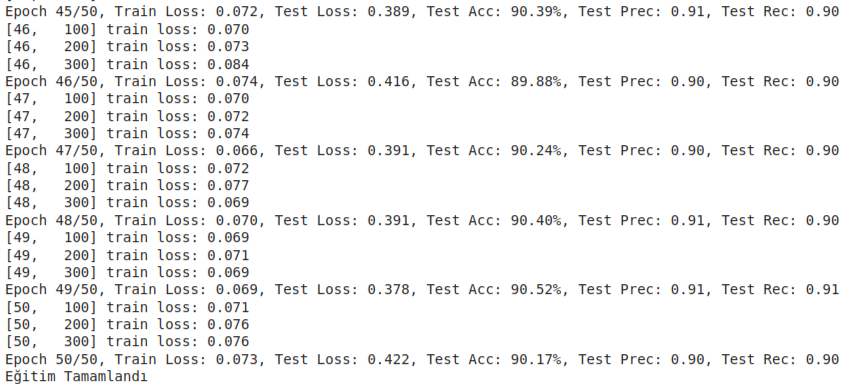
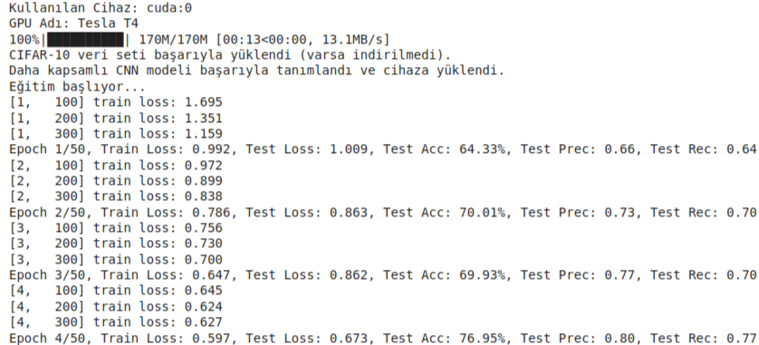
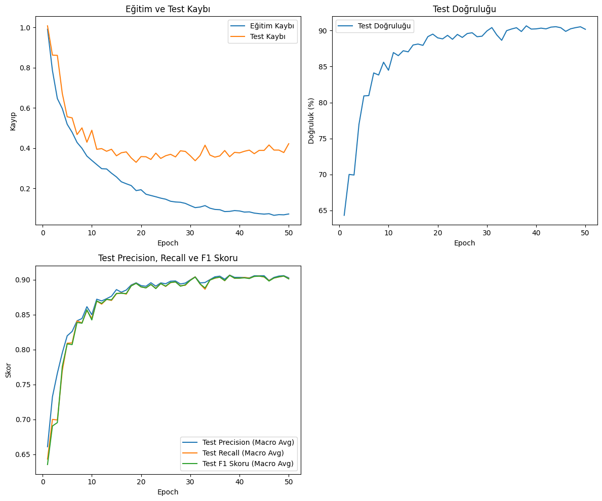
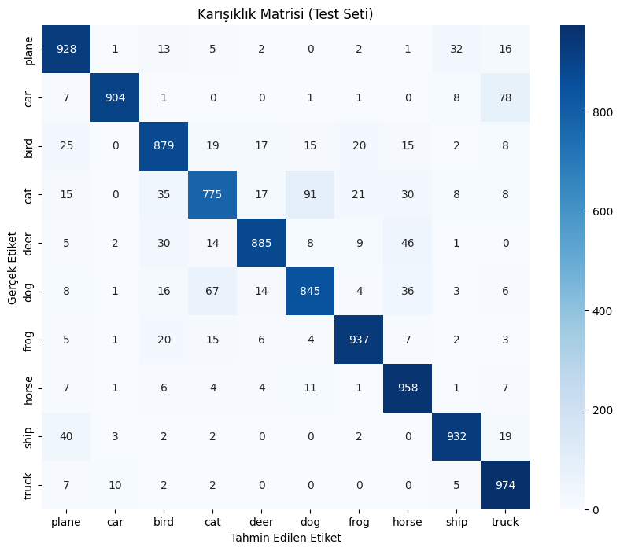
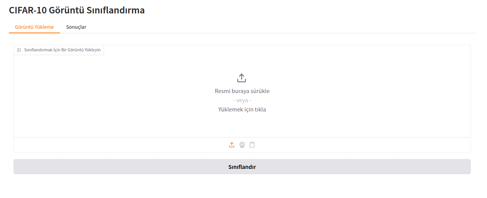
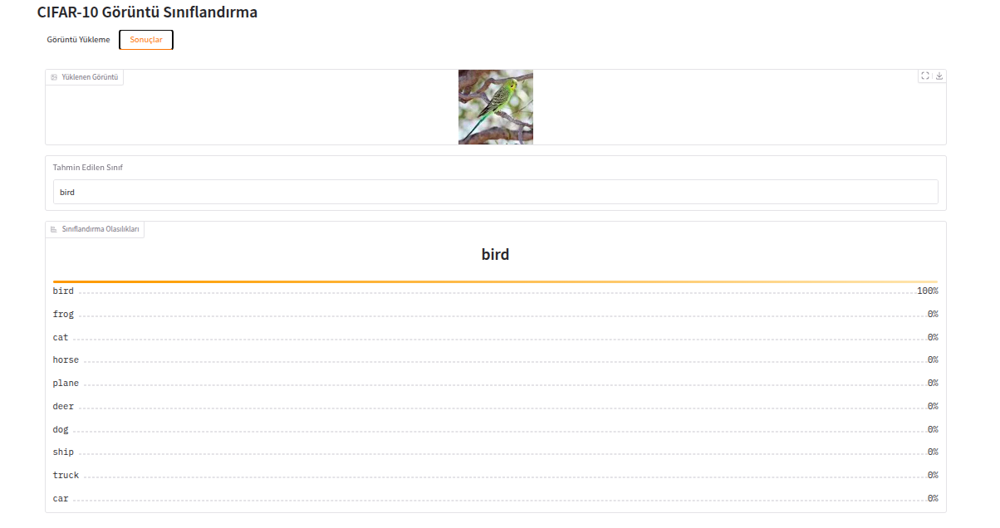

# Yapay Zeka Destekli Görüntü Sınıflandırıcı (CIFAR-10)

## Proje Tanımı ve Hedef

Bu proje, bir Evrişimsel Sinir Ağı (CNN) modeli kullanarak CIFAR-10 veri setindeki görüntüleri 10 farklı sınıfa (uçak, araba, kuş, kedi, geyik, köpek, kurbağa, at, gemi, kamyon) sınıflandırmayı amaçlar. Projenin ana hedefi, eğitilmiş bir modelle görsel verileri doğru bir şekilde sınıflandıran ve kullanıcı dostu bir web arayüzü aracılığıyla bu sınıflandırma sonuçlarını sunan basit ve işlevsel bir yapay zeka uygulaması geliştirmektir.

## Fonksiyonel Gereksinimler

* Kullanıcı, bilgisayarından bir görüntü yükleyebilmelidir.
* Yüklenen görüntü otomatik olarak gerekli ön işleme adımlarından geçirilmelidir (boyutlandırma, normalizasyon).
* Eğitilmiş model, yüklenen görüntüyü sınıflandırarak sonucun hangi sınıfa ait olduğunu belirlemelidir.
* Sınıflandırma sonucu ve ilgili olasılıklar kullanıcıya anlaşılır bir web arayüzünde sunulmalıdır.

## Kullanılan Veri Seti

Bu projede görüntü sınıflandırma modeli eğitimi için CIFAR-10 veri seti kullanılmıştır.

* **CIFAR-10:** [https://www.cs.toronto.edu/~kriz/cifar.html](https://www.cs.toronto.edu/~kriz/cifar.html)
    * 10 farklı genel obje sınıfı içerir.
    * Görüntü boyutları 32x32 pikseldir.
    * Eğitim ve test setleri ayrılmıştır.

## Model Mimarisi

Projede, görüntü sınıflandırma için PyTorch kullanılarak özel bir Evrişimsel Sinir Ağı (CNN) modeli geliştirilmiştir. Model, evrişim katmanları, Batch Normalization, ReLU aktivasyon fonksiyonları, Max Pooling katmanları ve ezberlemeyi (overfitting) azaltmak için Dropout içeren tam bağlı (Fully Connected) katmanlardan oluşur.

### ComplexNet Model Mimarisi

Projede kullanılan `ComplexNet` modeli, CIFAR-10 gibi küçük boyutlu görüntüler için tasarlanmış çok katmanlı bir Evrişimsel Sinir Ağı (CNN) modelidir. Modelin katmanları ve veri akışı aşağıdaki gibidir:

1.  **Giriş Katmanı:** Model, 3 kanal (RGB renkli) ve 32x32 piksel boyutunda görüntüler alır.

2.  **Evrişim Blokları:** Görüntüden özellik çıkarmak için ardışık Evrişim (Convolutional), Batch Normalization, ReLU aktivasyon ve Max Pooling katmanları kullanılır.
    * **Birinci Blok:**
        * İlk Evrişim Katmanı (`conv1`): 3 giriş kanalını alır ve 32 çıkış kanalına dönüştürür (3x3 pencere, padding=1).
        * Birinci Batch Normalization Katmanı (`bn1`): Evrişim çıktısını normalize eder.
        * ReLU Aktivasyon Fonksiyonu: Doğrusal olmayan bir dönüşüm uygular.
        * İkinci Evrişim Katmanı (`conv2`): 32 giriş kanalını alır ve 64 çıkış kanalına dönüştürür (3x3 pencere, padding=1).
        * İkinci Batch Normalization Katmanı (`bn2`): Evrişim çıktısını normalize eder.
        * ReLU Aktivasyon Fonksiyonu.
        * Birinci Max Pooling Katmanı (`pool`): Görüntü boyutunu yarıya indirir (2x2 pencere).
    * **İkinci Blok:**
        * Üçüncü Evrişim Katmanı (`conv3`): 64 giriş kanalını alır ve 128 çıkış kanalına dönüştürür.
        * Üçüncü Batch Normalization Katmanı (`bn3`).
        * ReLU Aktivasyon Fonksiyonu.
        * Dördüncü Evrişim Katmanı (`conv4`): 128 giriş kanalını alır ve 128 çıkış kanalına dönüştürür.
        * Dördüncü Batch Normalization Katmanı (`bn4`).
        * ReLU Aktivasyon Fonksiyonu.
        * İkinci Max Pooling Katmanı (`pool2`): Görüntü boyutunu tekrar yarıya indirir.
    * **Üçüncü Blok:**
        * Beşinci Evrişim Katmanı (`conv5`): 128 giriş kanalını alır ve 256 çıkış kanalına dönüştürür.
        * Beşinci Batch Normalization Katmanı (`bn5`).
        * ReLU Aktivasyon Fonksiyonu.
        * Altıncı Evrişim Katmanı (`conv6`): 256 giriş kanalını alır ve 256 çıkış kanalına dönüştürür.
        * Altıncı Batch Normalization Katmanı (`bn6`).
        * ReLU Aktivasyon Fonksiyonu.
        * Üçüncü Max Pooling Katmanı (`pool3`): Görüntü boyutunu son kez yarıya indirir. (Bu katmanların sonunda görüntü boyutu 4x4 piksel olur).

3.  **Düzleştirme (Flattening):** Evrişim katmanlarından gelen çok boyutlu çıktı (256 filtre x 4x4 boyut), tam bağlı katmanlara beslenmeden önce tek boyutlu bir vektöre dönüştürülür.

4.  **Tam Bağlı (Fully Connected) Katmanlar:** Düzleştirilmiş vektör, nihai sınıflandırmayı yapmak için tam bağlı katmanlardan geçer.
    * Birinci Tam Bağlı Katman (`fc1`): 256 * 4 * 4 = 4096 özellik alır ve 1024 özelliğe dönüştürür.
    * Yedinci Batch Normalization Katmanı (`bn7`).
    * ReLU Aktivasyon Fonksiyonu.
    * Birinci Dropout Katmanı (`dropout1`): Ezberlemeyi azaltmak için nöronların %50'sini rastgele kapatır.
    * İkinci Tam Bağlı Katman (`fc2`): 1024 özellik alır ve 512 özelliğe dönüştürür.
    * Sekizinci Batch Normalization Katmanı (`bn8`).
    * ReLU Aktivasyon Fonksiyonu.
    * İkinci Dropout Katmanı (`dropout2`): Ezberlemeyi azaltmak için nöronların %50'sini rastgele kapatır.

5.  **Çıkış Katmanı:**
    * Üçüncü Tam Bağlı Katman (`fc3`): 512 özellik alır ve 10 çıkışa (her sınıf için bir skor) dönüştürür. Bu katmandan sonra genellikle bir aktivasyon fonksiyonu (softmax gibi) kullanılarak skorlar olasılıklara çevrilir, ancak bu genellikle kayıp fonksiyonunun (Cross-Entropy) içinde yapılır veya tahmin adımında ayrıca uygulanır.

Bu mimari, görüntüdeki yerel özellikleri (kenarlar, köşeler, desenler) evrişim katmanları aracılığıyla yakalar, pooling katmanları ile boyutu azaltır ve tam bağlı katmanlar ile bu özelliklere dayanarak nihai sınıflandırmayı yapar. Batch Normalization ve Dropout katmanları ise modelin eğitimini daha istikrarlı hale getirmeye ve ezberlemeyi önlemeye yardımcı olur.

## Ön İşleme

Model eğitimi ve arayüzde tahmin yapılırken aşağıdaki ön işleme adımları uygulanmıştır:

* **Yeniden Boyutlandırma:** Görüntüler modelin beklediği 32x32 piksel boyutuna yeniden boyutlandırılır.
* **Normalizasyon:** Görüntülerin piksel değerleri belirli bir ortalama ve standart sapmaya göre normalize edilir.
* **Veri Artırma (Augmentation):** Modelin eğitiminde ezberlemeyi önlemek ve genelleme yeteneğini artırmak için rastgele yatay çevirme ve rastgele kırpma gibi veri artırma teknikleri uygulanmıştır.

## Eğitim

Model eğitimi PyTorch kütüphanesi kullanılarak gerçekleştirilmiştir.

* **Kayıp Fonksiyonu:** Çok sınıflı sınıflandırma için Cross-Entropy Loss kullanılmıştır.
* **Optimizer:** Model ağırlıklarını güncellemek için Adam optimizer kullanılmıştır.
* **Epoch Sayısı:** Model (50) epoch boyunca eğitilmiştir. 
* **Donanım:** Eğitim GPU üzerinde gerçekleştirilmiştir.



## Değerlendirme Metrikleri

Eğitim sürecinde ve test veri seti üzerinde modelin performansı çeşitli metriklerle değerlendirilmiştir:

* **Accuracy (Doğruluk):** Modelin toplamda doğru sınıflandırdığı örneklerin yüzdesi.
* **Precision (Kesinlik):** Modelin pozitif olarak tahmin ettiği örneklerin ne kadarının gerçekten pozitif olduğu (her sınıf için ayrı ayrı veya ortalama).
* **Recall (Geri Çağırma):** Gerçekte pozitif olan örneklerin ne kadarının model tarafından doğru şekilde pozitif olarak tahmin edildiği (her sınıf için ayrı ayrı veya ortalama).
* **F1 Score:** Precision ve Recall'ın harmonik ortalaması, özellikle dengesiz veri setlerinde performansı değerlendirmek için kullanışlıdır.

Test Doğruluğu: %90.17, Test Precision (Macro Avg): 0.91, Test Recall (Macro Avg): 0.91, 




## Arayüz

Proje, kullanıcı dostu bir web arayüzü aracılığıyla görüntü sınıflandırma modelini kullanıma sunar. Arayüz için Gradio  kütüphanesi kullanılmıştır.
## Ekran Görüntüleri

İşte arayüzümüzden bazı örnek ekran görüntüleri:






### Gradio Arayüzü

Arayüz, Gradio'nun `Blocks` yapısı kullanılarak sekmeli bir tasarıma sahiptir.

* **Görüntü Yükleme Sekmesi:** Kullanıcının sınıflandırmak istediği görüntüyü yüklemesi için bir alan bulunur.
* **Sonuçlar Sekmesi:** Görüntü yüklendikten ve sınıflandırıldıktan sonra, yüklenen görüntünün kendisi, tahmin edilen sınıf etiketi ve tüm sınıflara ait olasılıklar bu sekmede gösterilir.
* "Sınıflandır" düğmesi tahmin işlemini başlatır.


## Kurulum

Projeyi yerel bilgisayarınızda kurmak ve çalıştırmak için aşağıdaki adımları izleyin:

1.  Bu GitHub deposunu bilgisayarınıza klonlayın veya ZIP olarak indirin.
2.  Proje klasörüne gidin.
3.  Gerekli Python kütüphanelerini `requirements.txt` dosyasını kullanarak kurun:
    bash
    pip install -r requirements.txt
4.  Eğitilmiş model dosyasının (`cifar10_complex_cnn.pth` gibi) projenizin kök dizininde veya kodunuzda belirtilen doğru yolda bulunduğundan emin olun. 
## Nasıl Çalıştırılır

### Modeli Eğitme (Opsiyonel, eğer kendiniz eğitmek isterseniz)
(Model eğitim betiğinizin adını yazın, örn: `train_cifar10.py`)
```bash
python train_cifar10.py
